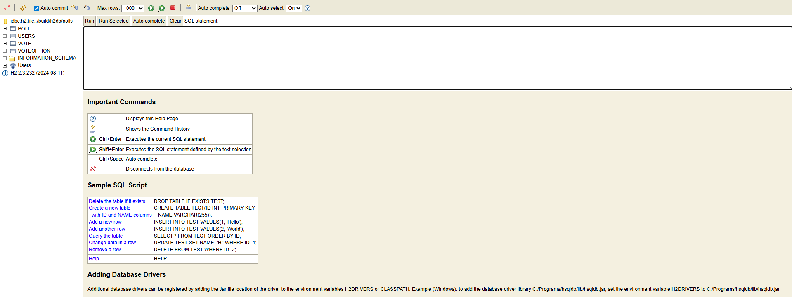
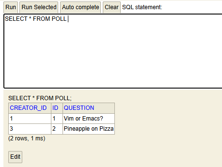
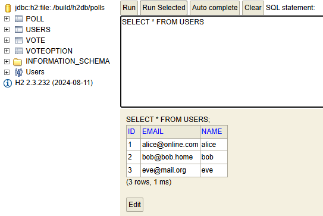

# DAT250 Experiment Assignment 4

## Technical problems encountered

During this exercise I integrated the Java Persistence API (JPA) with my existing domain model using Hibernate and an H2 database.  
One main challenge was dependency management. At first, I had Spring Boot starter dependencies in my `build.gradle`, which conflicted with the goal of using Hibernate without Spring auto-configuration. Removing those dependencies and adding only the necessary Hibernate, JPA API, and H2 dependencies solved this.  

Another issue was with the `EntityManagerFactory`. The provided test code used a `runInTransaction` method that is not available in the standard Jakarta Persistence API. I had to update the setup code to use manual transaction handling (`EntityTransaction`) instead.  

Finally, I had problems inspecting the in-memory database, since by default the database disappears after the tests complete. I fixed this by using the `DB_CLOSE_DELAY=-1` flag in the JDBC URL, and later by switching to a file-based H2 database for inspection.

## Database inspection

To verify that the JPA mappings worked, I used the H2 Console to inspect the database.  
After running the `PollsTest`, Hibernate had created four tables: `USERS`, `POLL`, `VOTE`, and `VOTEOPTION`.

### Tables created

